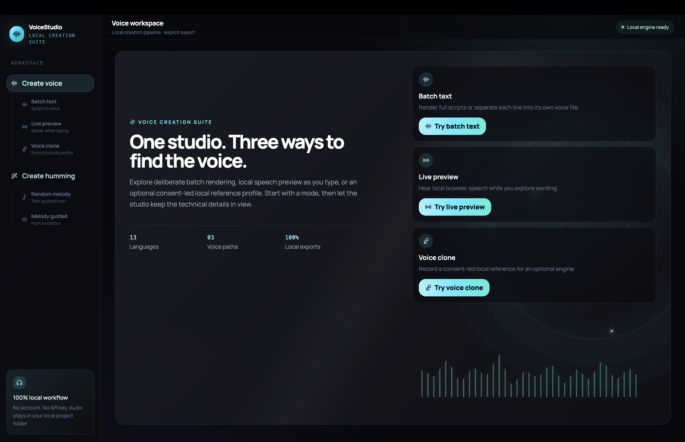
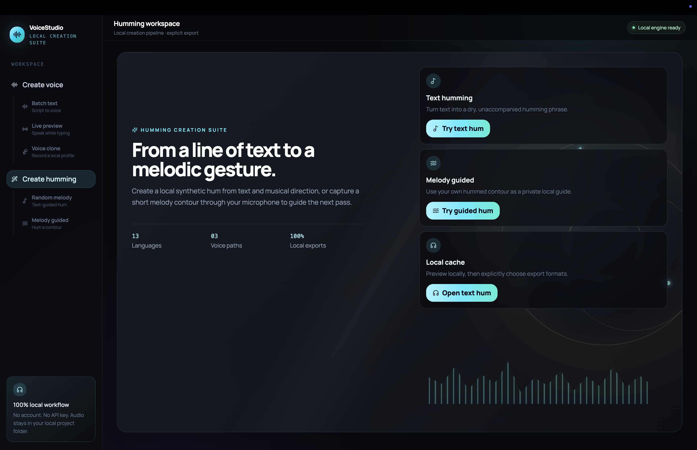
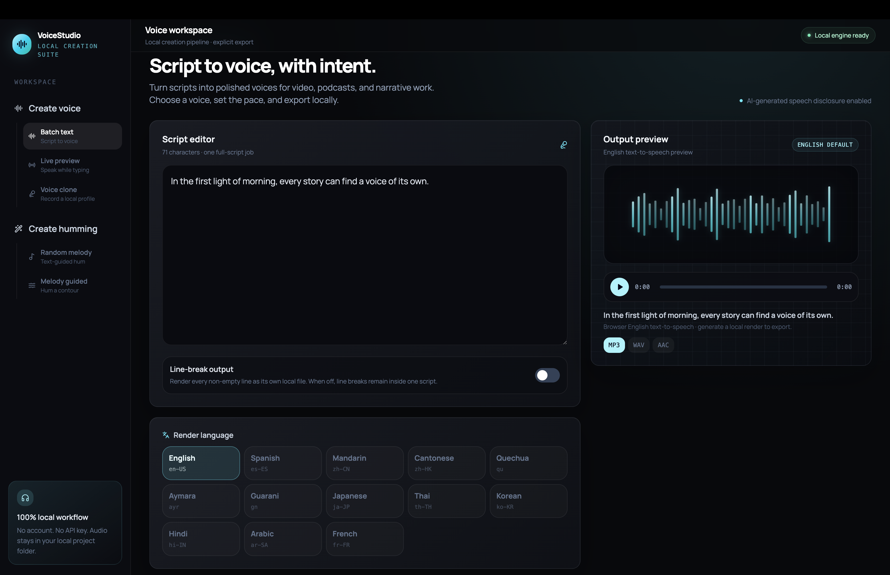
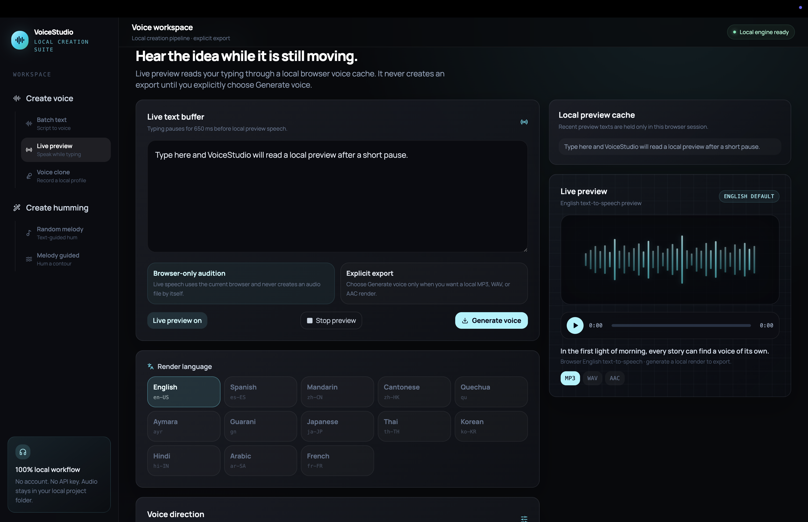
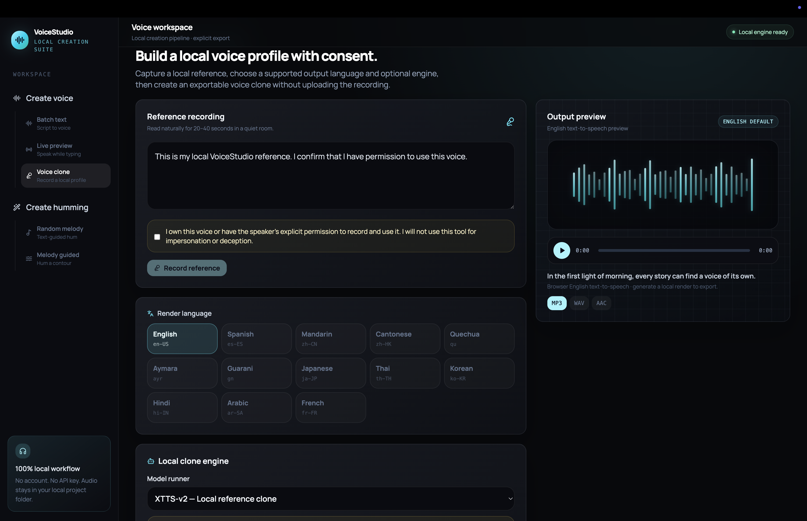
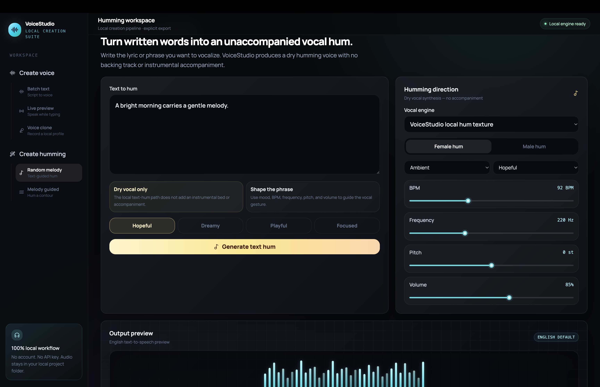

# VoiceStudio

**VoiceStudio** is a local-first, open-source studio for creating multilingual voiceovers and unaccompanied vocal hums. It brings batch text-to-speech, live browser audition, consent-led local voice cloning, text humming, melody-guided humming, local audio preview, and MP3/WAV/AAC export into one focused workspace.

The default workflow requires **no account, API key, or cloud deployment**. VoiceStudio runs on your computer and stores recordings and generated files in the project folder. Its default Edge Neural speech path does require an internet connection during synthesis because `edge-tts` uses the Microsoft Edge online voice service; it is free to use in this project, but it is not a self-hosted offline TTS service or a service with an availability guarantee.[1]





> VoiceStudio is designed for consent-based, local creative work. Only use voice cloning with your own voice or with the speaker’s explicit permission. Do not use the application for impersonation, fraud, or deceptive audio.

## What you can create

| Workspace | Direct address | Primary purpose | Preview and export behavior |
|---|---|---|---|
| **Create Voice** | `/create-voice` | Overview of the three voice workflows | Navigate directly to Batch text, Live preview, or Voice clone. |
| **Batch text** | `/create-voice/batch` | Turn a full script or separate lines into voiceover files | Uses the selected TTS engine; preview and export as MP3, WAV, or AAC. |
| **Live preview** | `/create-voice/live-preview` | Hear text while editing | Uses browser speech for quick local audition; generate explicitly for an exportable render. |
| **Voice clone** | `/create-voice/clone` | Create a local reference-based voice profile | Requires a consent acknowledgement and an optional local clone engine. |
| **Create Humming** | `/create-humming` | Overview of humming workflows | Navigate to Text humming or Melody guided. |
| **Text humming** | `/create-humming/text-hum` | Create a dry, unaccompanied vocal hum from text | Adjust musical direction, generate locally, then preview or export. |
| **Melody guided** | `/create-humming/melody-guided` | Guide a new hum with a recorded melodic contour | Records a short local microphone contour and uses it to shape a new local hum. |

## Key capabilities

VoiceStudio supports **13 languages**: English, Spanish, Mandarin, Cantonese, Quechua, Central Aymara, Guarani, Japanese, Thai, Korean, Hindi, Arabic, and French. English, Spanish, Mandarin, and Cantonese are positioned first in the UI for common voiceover workflows. Most languages use Edge Neural presets; Quechua and Guarani use the optional offline eSpeak NG path, while Central Aymara uses an optional local MMS-TTS model.[1] [2] [3]

Every voice workspace provides named female and male voice directions where the underlying engine offers them. Batch text also offers **News Anchor**, **Storyteller**, **Calm**, and **Energetic** performance presets, alongside manual controls for pitch, speed, volume, and pause length. Changing performance settings in Batch text updates the local preview after a short debounce, while the explicit **Generate voice** action remains responsible for final exportable files.

The shared output player always has a useful starting state. Before you generate anything, it displays a default English sample sentence with an animated waveform. Its play control uses your browser’s English text-to-speech voice; after a local render is generated, the same player switches to that local audio and exposes the selected MP3, WAV, or AAC export action.

## Requirements

The base application is developed and verified with macOS, but the same toolchain can be installed on other operating systems using their equivalent package manager commands.

| Dependency | Required for | Suggested macOS installation or check |
|---|---|---|
| Node.js 22 or later | React frontend and local server | `node --version` |
| pnpm 10 or later | Installing and running JavaScript packages | `pnpm --version` |
| Python 3.9 or later | Default `edge-tts` runtime | `python3 --version` |
| FFmpeg | WAV/AAC conversion and pause insertion | `brew install ffmpeg` |
| Internet connection | Default Edge Neural rendering | Needed only while Edge voices synthesize audio |
| eSpeak NG, optional | Offline Quechua and Guarani speech | `brew install espeak-ng` |
| Python 3.11, optional | XTTS-v2 local voice clone runner | `brew install python@3.11` |
| Python 3.10, optional | CosyVoice 2/3 local runner | `brew install python@3.10` |

FFmpeg is used locally to create WAV and AAC copies from generated audio. The project does not upload the source script, microphone recording, or generated file to a VoiceStudio cloud service.[7]

## Quick start

Clone the repository, install dependencies, create the default Python environment, and start the development server.

```bash
git clone https://github.com/CroireF/LocalVoiceStudio.git
cd LocalVoiceStudio

pnpm install
pnpm voice:setup

# Install once if FFmpeg is not available.
brew install ffmpeg

pnpm dev
```

Open the address printed in the terminal, usually **http://localhost:3000**. The first time you generate with an Edge Neural voice, the local Python environment contacts the Edge voice service, receives the audio response, and writes the rendered files into `local-data/audio/`.

To confirm the installation before creative work, run:

```bash
pnpm test
pnpm check
```

The standard suite covers the language catalog, render request handling, Batch Text preview sequencing, voice-direction routing, browser audition behavior, and MP3/WAV/AAC generation. Some optional model integration tests remain skipped unless their model environment is intentionally enabled.

## Using the studio

### 1. Create a voiceover with Batch text



Open **Create voice → Batch text**, or visit `/create-voice/batch`. Paste or type your narration in the Script editor, choose a render language, choose a named voice direction, and select a performance style. Fine-tune Pitch, Speed / Rate, Volume, and Pause / Break when needed.

Use **Line-break output** when each non-empty line should become a separate generated audio file. Keep it off when line breaks should be read as part of one continuous script. The Output preview card reflects the most recent local render, and **Generation history** retains Batch text and Voice clone renders in browser local storage for replay and re-download.

### 2. Audition copy with Live preview



Open **Create voice → Live preview**, or visit `/create-voice/live-preview`. As you pause while typing, VoiceStudio uses the browser’s built-in `SpeechSynthesis` capability to audition the current text. This is intentionally a low-latency local preview, not an exported file.

The selected language, voice direction, and performance controls are also available on this page. Browser-installed voices vary by operating system and browser, so a live audition may not sound identical to the final Edge/eSpeak/MMS render. When the wording is ready, select **Generate voice** to create a local MP3/WAV/AAC render through the configured export pipeline.

### 3. Create a consent-led local voice profile



Open **Create voice → Voice clone**, or visit `/create-voice/clone`. Read the supplied consent text aloud, confirm that you own the voice or have permission to use it, then select **Record reference**. The reference recording is saved to the local project only after this acknowledgement.

Choose a clone runner, a target language, and the text to render. **XTTS-v2**, **CosyVoice 2**, and **CosyVoice 3** are optional local integrations: VoiceStudio does not bundle their model weights. If the selected engine has not been installed, the page explains the relevant setup command instead of sending the recording to an external service.

### 4. Generate text humming



Open **Create humming → Random melody**, or visit `/create-humming/text-hum`. Enter a phrase and choose the vocal engine, gender, mood, style, BPM, base frequency, pitch, and volume. The default engine produces a dry synthetic vocal hum with **no accompaniment, backing track, or instrumental layer**.

Text humming is a musical gesture rather than guaranteed intelligible sung lyric synthesis. An optional CosyVoice path can use an existing local reference profile to attempt a more speech-like vocal hum; this is experimental and may not behave like a fully trained singing model.

### 5. Guide a hum with your own contour


Open **Create humming → Melody guided**, or visit `/create-humming/melody-guided`. Select **Record melody**, hum a short phrase into your microphone, and stop the capture when finished. VoiceStudio extracts a local pitch contour in the browser, then uses it to guide the next generated dry hum.

The microphone clip remains in the current browser session. Melody guided mode does not identify the singer, train a model, or clone a performer’s singing voice.

## Language and engine support

| Language | Default engine | Example female / male preset | Connectivity and setup |
|---|---|---|---|
| English | Edge Neural | Aria / Christopher | Internet required during synthesis |
| Spanish | Edge Neural | Elvira / Alvaro | Internet required during synthesis |
| Mandarin | Edge Neural | Xiaoxiao / Yunxi | Internet required during synthesis |
| Cantonese | Edge Neural | HiuMaan / WanLung | Internet required during synthesis |
| Quechua | eSpeak NG | Quechua F3 / Quechua M3 | Install eSpeak NG; offline afterwards |
| Central Aymara | MMS-TTS | One local MMS voice | Install extended runtime; model downloads on first use |
| Guarani | eSpeak NG | Guarani F3 / Guarani M3 | Install eSpeak NG; offline afterwards |
| Japanese | Edge Neural | Nanami / Keita | Internet required during synthesis |
| Thai | Edge Neural | Premwadee / Niwat | Internet required during synthesis |
| Korean | Edge Neural | SunHi / InJoon | Internet required during synthesis |
| Hindi | Edge Neural | Swara / Madhur | Internet required during synthesis |
| Arabic | Edge Neural | Zariyah / Hamed | Internet required during synthesis |
| French | Edge Neural | Denise / Henri | Internet required during synthesis |

Install the optional fully local language engines only when you need them:

```bash
# Offline Quechua and Guarani support.
brew install espeak-ng

# Local Central Aymara MMS-TTS support.
pnpm voice:setup:extended
```

The first Central Aymara render downloads the `facebook/mms-tts-ayr` checkpoint. That model is released under **CC-BY-NC 4.0**, so review its terms before any commercial use.[3]

## Audio preview, export, and local data

VoiceStudio keeps the interactive workflow local to your machine. The practical storage locations are summarized below.

| Item | Location or behavior | Notes |
|---|---|---|
| Generated audio | `local-data/audio/` | Local MP3, WAV, and AAC render files; ignored by Git. |
| Voice-clone references | `local-data/references/` | Saved only after explicit permission acknowledgement. |
| Temporary render work | `local-data/work/` | Intermediate local processing files. |
| Batch and clone history | Browser `localStorage` | Enables replay and export controls in the current browser. |
| Live preview cache | Browser session | Stores recent preview text, not an exportable audio recording. |
| Melody capture | Browser session | Used to calculate a local pitch contour for Melody guided mode. |

The output player supports **MP3**, **WAV**, and **AAC**. Edge Neural emits MP3 first; FFmpeg creates WAV and AAC variants locally. The selected pause value is inserted between multiple generated segments when the workflow produces more than one segment.

## Optional local model setup

### XTTS-v2 voice clone

XTTS-v2 is available for local research and non-commercial use through an isolated Python 3.11 environment. The setup pins compatible PyTorch, torchaudio, and Transformers versions to avoid known checkpoint-loading and ABI issues.

```bash
pnpm voice:setup
pnpm voice:setup:clone
```

On first use, review the official XTTS-v2 model card and **Coqui Public Model License** yourself. If you choose to accept the model terms, start the application with an explicit acknowledgement:

```bash
COQUI_TOS_AGREED=1 pnpm dev
```

XTTS-v2 supports the VoiceStudio clone workflow for English, Mandarin, Spanish, Japanese, Korean, Hindi, Arabic, and French. The model may be large and its first local download or CPU render may take time. VoiceStudio does not accept third-party model terms on your behalf.[4]

### CosyVoice 2 and CosyVoice 3

CosyVoice 2 and Fun-CosyVoice 3 are optional, separately installed local runners for reference-based voice generation and experimental text humming. They require their official runtime, a Python 3.10 virtual environment, and local model weights.

```bash
pnpm voice:setup:cosyvoice

# Optional: download CosyVoice 2 weights into the expected local directory.
.cosyvoice-venv/bin/python -c "from huggingface_hub import snapshot_download; snapshot_download('FunAudioLLM/CosyVoice2-0.5B', local_dir='local-data/cosyvoice-runtime/pretrained_models/CosyVoice2-0.5B')"

# Optional: download Fun-CosyVoice 3 weights into the expected local directory.
.cosyvoice-venv/bin/python -c "from huggingface_hub import snapshot_download; snapshot_download('FunAudioLLM/Fun-CosyVoice3-0.5B-2512', local_dir='local-data/cosyvoice-runtime/pretrained_models/Fun-CosyVoice3-0.5B')"
```

Start the app with the local CosyVoice runner paths when using it:

```bash
VOICE_STUDIO_COSYVOICE_DIR=local-data/cosyvoice-runtime \
VOICE_STUDIO_COSYVOICE_PYTHON=.cosyvoice-venv/bin/python \
pnpm dev
```

Read the official model cards and any linked license terms before downloading weights or using the models in a product.[5] [6]

## Common troubleshooting

| Problem | Likely cause | What to do |
|---|---|---|
| `pnpm: command not found` | pnpm is not installed or activated | Enable Corepack with `corepack enable`, then install/activate pnpm. |
| The app starts but audio cannot be generated | Default Python environment is missing | Run `pnpm voice:setup` from the project root and restart `pnpm dev`. |
| MP3 works but WAV or AAC export fails | FFmpeg is missing or not on `PATH` | Run `brew install ffmpeg`, verify with `ffmpeg -version`, then retry. |
| Edge voice generation fails | No network, unavailable Edge voice, or service change | Check connectivity, choose another preset in the same language, and retry. |
| Quechua or Guarani is unavailable | eSpeak NG is not installed | Run `brew install espeak-ng`, then restart the server. |
| Central Aymara is unavailable | Extended MMS runtime/model is not ready | Run `pnpm voice:setup:extended`; allow the first model download to finish. |
| Voice Clone reports that a runner is not ready | The chosen optional engine is not installed | Follow the XTTS-v2 or CosyVoice setup above; do not upload your reference recording elsewhere. |
| Browser live voice sounds different from final output | Browser `SpeechSynthesis` voices are platform-specific | Use Live preview for fast wording checks, then generate a local render for the final result. |

## Project structure

```text
client/                  React interface, route shell, and studio UI
client/src/pages/Home.tsx  Workspace controls and navigation
server/                  tRPC routes plus local voice, hum, and clone pipelines
shared/voice.ts          Language catalog, voice defaults, style presets, and helpers
scripts/                 Optional XTTS-v2 and CosyVoice local runners
local-data/              Generated audio, local references, temporary files, and optional models
docs/                    Architecture, multilingual, model, and open-source documentation
```

## Open-source use and contribution

VoiceStudio is released under the [MIT License](LICENSE). Before contributing, read the [contribution guide](CONTRIBUTING.md), [security policy](SECURITY.md), and [open-source deployment guide](docs/OPEN_SOURCE_DEPLOYMENT_GUIDE.md).

Please do not commit generated audio, model weights, Python virtual environments, `node_modules`, `.env` files, personal reference recordings, or access tokens. The repository’s `.gitignore` is designed to keep these local artifacts out of source control.

## References

[1] [edge-tts project](https://github.com/rany2/edge-tts)
[2] [eSpeak NG project](https://github.com/espeak-ng/espeak-ng)
[3] [MMS-TTS Central Aymara model card](https://huggingface.co/facebook/mms-tts-ayr)
[4] [XTTS-v2 model card and Coqui Public Model License](https://huggingface.co/coqui/XTTS-v2)
[5] [CosyVoice 2 official model card](https://huggingface.co/FunAudioLLM/CosyVoice2-0.5B)
[6] [Fun-CosyVoice 3 official model card](https://huggingface.co/FunAudioLLM/Fun-CosyVoice3-0.5B)
[7] [FFmpeg project](https://ffmpeg.org/)
